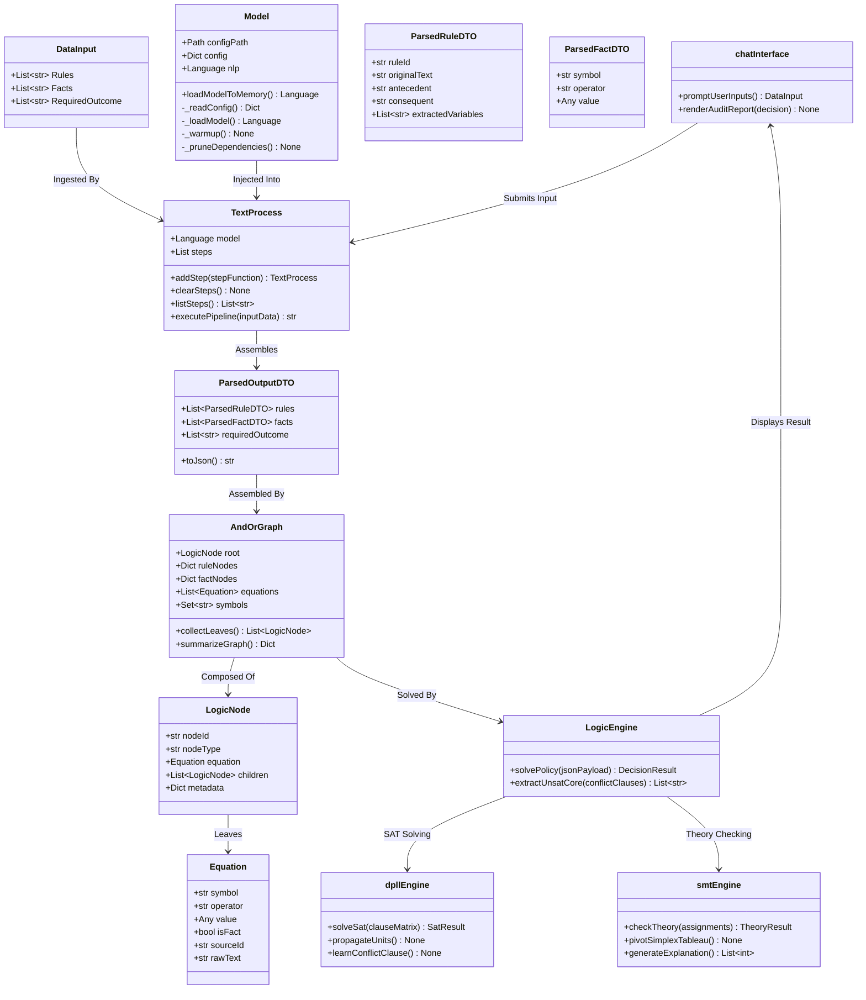

# Component Diagram

This document describes the modular component architecture, classes, and Pydantic DTO contracts across Yukti.

```mermaid
classDiagram
    direction TB

    class Model {
        +Path configPath
        +Dict config
        +Language nlp
        +loadModelToMemory() Language
        -_readConfig() Dict
        -_loadModel() Language
        -_warmup() None
        -_pruneDependencies() None
    }

    class DataInput {
        +List~str~ Rules
        +List~str~ Facts
        +List~str~ RequiredOutcome
    }

    class ParsedRuleDTO {
        +str ruleId
        +str originalText
        +str antecedent
        +str consequent
        +List~str~ extractedVariables
    }

    class ParsedFactDTO {
        +str symbol
        +str operator
        +Any value
    }

    class ParsedOutputDTO {
        +List~ParsedRuleDTO~ rules
        +List~ParsedFactDTO~ facts
        +List~str~ requiredOutcome
        +toJson() str
    }

    class TextProcess {
        +Language model
        +List steps
        +addStep(stepFunction) TextProcess
        +clearSteps() None
        +listSteps() List~str~
        +executePipeline(inputData) str
    }

    class Equation {
        +str symbol
        +str operator
        +Any value
        +bool isFact
        +str sourceId
        +str rawText
    }

    class LogicNode {
        +str nodeId
        +str nodeType
        +Equation equation
        +List~LogicNode~ children
        +Dict metadata
    }

    class AndOrGraph {
        +LogicNode root
        +Dict ruleNodes
        +Dict factNodes
        +List~Equation~ equations
        +Set~str~ symbols
        +collectLeaves() List~LogicNode~
        +summarizeGraph() Dict
    }

    class LogicEngine {
        +solvePolicy(jsonPayload) DecisionResult
        +extractUnsatCore(conflictClauses) List~str~
    }

    class dpllEngine {
        +solveSat(clauseMatrix) SatResult
        +propagateUnits() None
        +learnConflictClause() None
    }

    class smtEngine {
        +checkTheory(assignments) TheoryResult
        +pivotSimplexTableau() None
        +generateExplanation() List~int~
    }

    class chatInterface {
        +promptUserInputs() DataInput
        +renderAuditReport(decision) None
    }

    DataInput --> TextProcess : Ingested By
    Model --> TextProcess : Injected Into
    TextProcess --> ParsedOutputDTO : Assembles
    ParsedOutputDTO --> AndOrGraph : Assembled By
    AndOrGraph --> LogicNode : Composed Of
    LogicNode --> Equation : Leaves
    AndOrGraph --> LogicEngine : Solved By
    LogicEngine --> dpllEngine : SAT Solving
    LogicEngine --> smtEngine : Theory Checking
    chatInterface --> TextProcess : Submits Input
    chatInterface <-- LogicEngine : Displays Result
```
