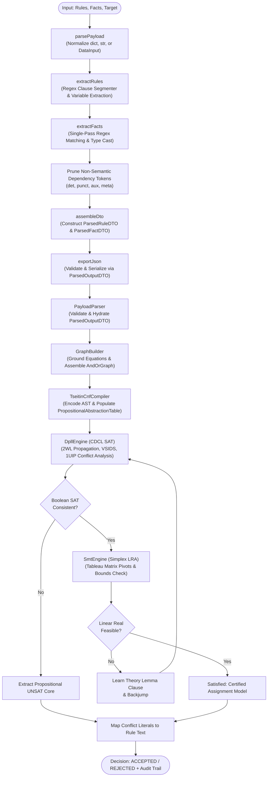

# Execution & Decision Flow Diagram

This document illustrates the execution lifecycle from input ingestion to certified SMT verification.

```mermaid
flowchart TD
    Start(["Input: Rules, Facts, Target"]) --> Parse["parsePayload<br/>(Normalize dict, str, or DataInput)"]
    Parse --> RuleExtract["extractRules<br/>(Regex Clause Segmenter & Variable Extraction)"]
    RuleExtract --> FactExtract["extractFacts<br/>(Single-Pass Regex Matching & Type Cast)"]
    FactExtract --> DepPrune["Prune Non-Semantic Dependency Tokens<br/>(det, punct, aux, meta)"]
    DepPrune --> DTOAssemble["assembleDto<br/>(Construct ParsedRuleDTO & ParsedFactDTO)"]
    DTOAssemble --> JSONExport["exportJson<br/>(Validate & Serialize via ParsedOutputDTO)"]
    
    JSONExport --> PP["PayloadParser<br/>(Validate & Hydrate ParsedOutputDTO)"]
    PP --> GB["GraphBuilder<br/>(Ground Equations & Assemble AndOrGraph)"]
    GB --> Tseitin["TseitinCnfCompiler<br/>(Encode AST & Populate PropositionalAbstractionTable)"]
    
    Tseitin --> CDCL["DpllEngine (CDCL SAT)<br/>(2WL Propagation, VSIDS, 1UIP Conflict Analysis)"]
    
    CDCL --> SATCheck{"Boolean SAT<br/>Consistent?"}
    SATCheck -- No --> SATUnsat["Extract Propositional UNSAT Core"]
    SATCheck -- Yes --> Simplex["SmtEngine (Simplex LRA)<br/>(Tableau Matrix Pivots & Bounds Check)"]
    
    Simplex --> TheoryCheck{"Linear Real<br/>Feasible?"}
    TheoryCheck -- No --> LearnConflict["Learn Theory Lemma Clause<br/>& Backjump"]
    LearnConflict --> CDCL
    TheoryCheck -- Yes --> SatSatisfied["Satisfied: Certified Assignment Model"]
    
    SATUnsat --> FormatResult["Map Conflict Literals to Rule Text"]
    SatSatisfied --> FormatResult
    FormatResult --> Verdict(["Decision: ACCEPTED / REJECTED + Audit Trail"])
```
