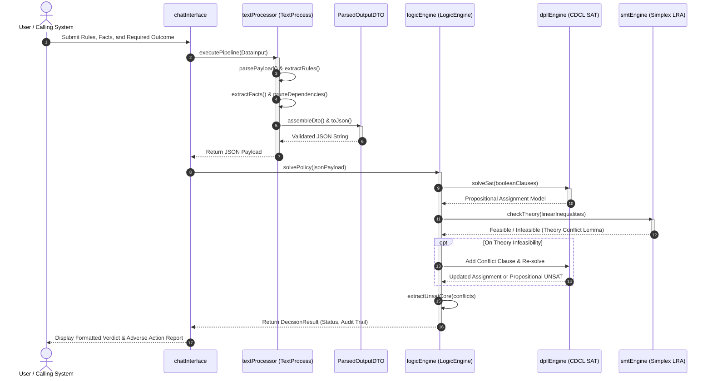

# Runtime Sequence Diagram

This document illustrates the runtime interactions between the user, chat interface, perception engine, and formal reasoning solvers.

```mermaid
sequenceDiagram
    autonumber
    actor User as User / Calling System
    participant UI as chatInterface
    participant TP as textProcessor (TextProcess)
    participant DTO as ParsedOutputDTO
    participant LE as logicEngine (LogicEngine)
    participant DPLL as dpllEngine (CDCL SAT)
    participant SMT as smtEngine (Simplex LRA)

    User->>UI: Submit Rules, Facts, and Required Outcome
    UI->>TP: executePipeline(DataInput)
    activate TP
    TP->>TP: parsePayload() & extractRules()
    TP->>TP: extractFacts() & pruneDependencies()
    TP->>DTO: assembleDto() & toJson()
    activate DTO
    DTO-->>TP: Validated JSON String
    deactivate DTO
    TP-->>UI: Return JSON Payload
    deactivate TP

    UI->>LE: solvePolicy(jsonPayload)
    activate LE
    LE->>DPLL: solveSat(booleanClauses)
    activate DPLL
    DPLL-->>LE: Propositional Assignment Model
    deactivate DPLL

    LE->>SMT: checkTheory(linearInequalities)
    activate SMT
    SMT-->>LE: Feasible / Infeasible (Theory Conflict Lemma)
    deactivate SMT

    opt On Theory Infeasibility
        LE->>DPLL: Add Conflict Clause & Re-solve
        DPLL-->>LE: Updated Assignment or Propositional UNSAT
    end

    LE->>LE: extractUnsatCore(conflicts)
    LE-->>UI: Return DecisionResult (Status, Audit Trail)
    deactivate LE

    UI-->>User: Display Formatted Verdict & Adverse Action Report
```
