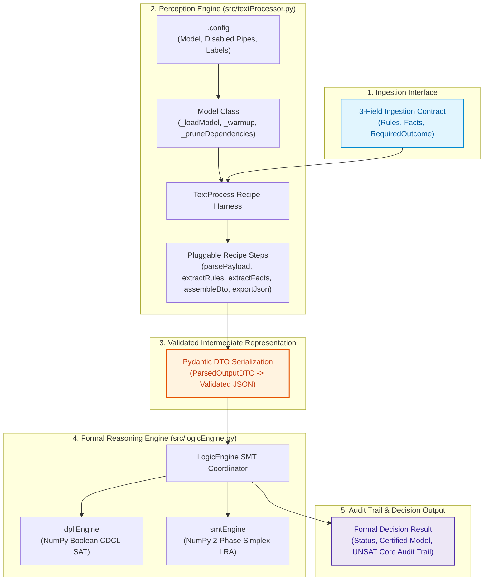

# System Overview Architecture

This document describes the high-level end-to-end data processing and reasoning flow of the Shiva / Yukti decision engine.

```mermaid
graph TD
    classDef inputStyle fill:#e1f5fe,stroke:#0288d1,stroke-width:2px,color:#01579b;
    classDef perceptionStyle fill:#f3e5f5,stroke:#7b1fa2,stroke-width:2px,color:#4a148c;
    classDef dtoArray fill:#fff3e0,stroke:#e65100,stroke-width:2px,color:#bf360c;
    classDef reasoningStyle fill:#e8f5e9,stroke:#2e7d32,stroke-width:2px,color:#1b5e20;
    classDef outputStyle fill:#ede7f6,stroke:#512da8,stroke-width:2px,color:#311b92;

    subgraph UserTier["1. Ingestion Interface"]
        Input["3-Field Ingestion Contract<br/>(Rules, Facts, RequiredOutcome)"]:::inputStyle
    end

    subgraph PerceptionTier["2. Perception Engine (src/textProcessor.py)"]
        Config[".config<br/>(Model, Disabled Pipes, Labels)"]
        Model["Model Class<br/>(_loadModel, _warmup, _pruneDependencies)"]
        Harness["TextProcess Recipe Harness"]
        Recipe["Pluggable Recipe Steps<br/>(parsePayload, extractRules, extractFacts, assembleDto, exportJson)"]
        Config --> Model
        Model --> Harness
        Harness --> Recipe
    end

    subgraph DataTier["3. Validated Intermediate Representation"]
        DTO["Pydantic DTO Serialization<br/>(ParsedOutputDTO -> Validated JSON)"]:::dtoArray
    end

    subgraph ReasoningTier["4. Formal Reasoning Engine (src/logicEngine.py)"]
        Logic["LogicEngine SMT Coordinator"]
        DPLL["dpllEngine<br/>(NumPy Boolean CDCL SAT)"]
        SMT["smtEngine<br/>(NumPy 2-Phase Simplex LRA)"]
        Logic --> DPLL
        Logic --> SMT
    end

    subgraph OutputTier["5. Audit Trail & Decision Output"]
        Decision["Formal Decision Result<br/>(Status, Certified Model, UNSAT Core Audit Trail)"]:::outputStyle
    end

    Input --> Harness
    Recipe --> DTO
    DTO --> Logic
    Logic --> Decision
```
